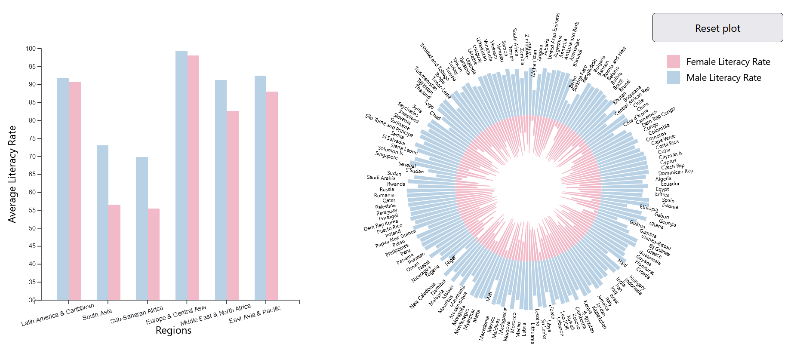
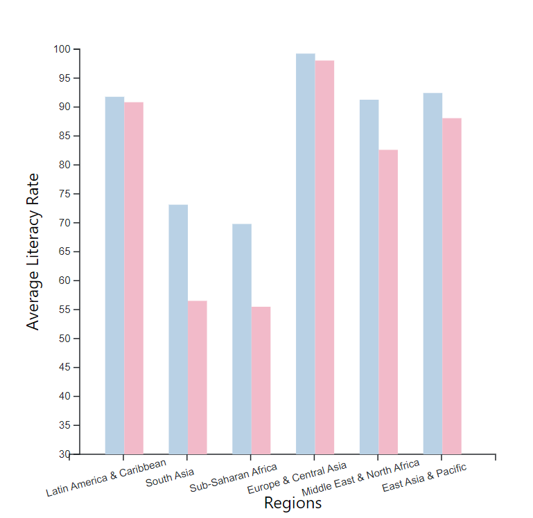
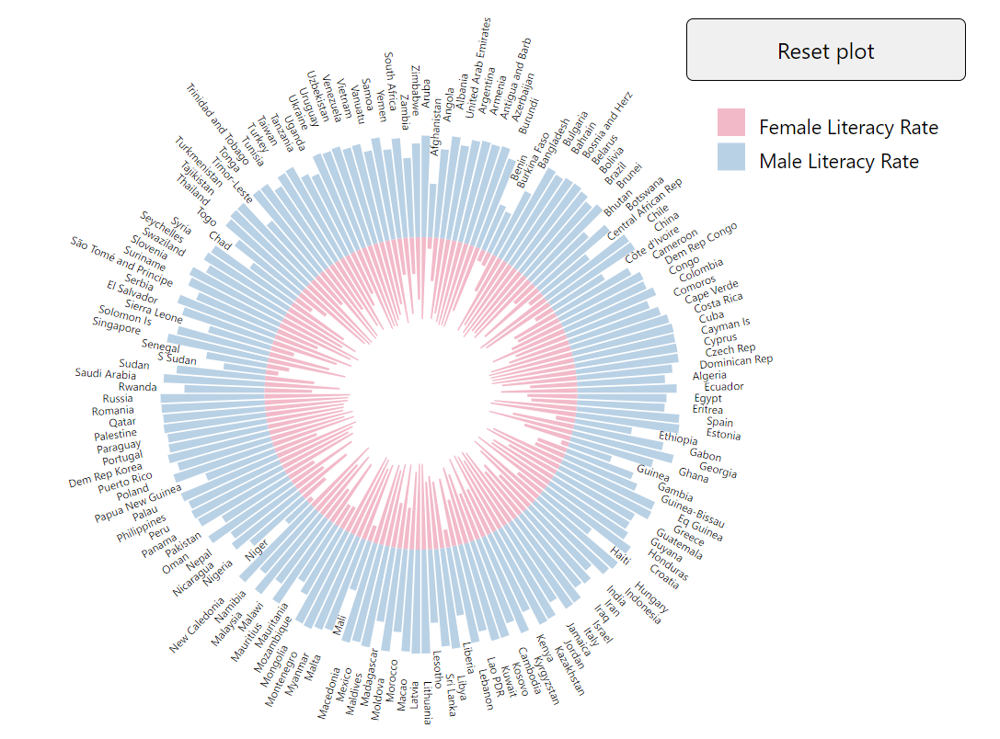
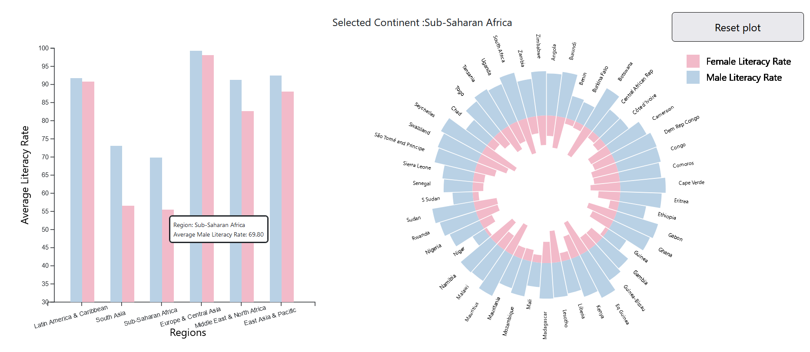
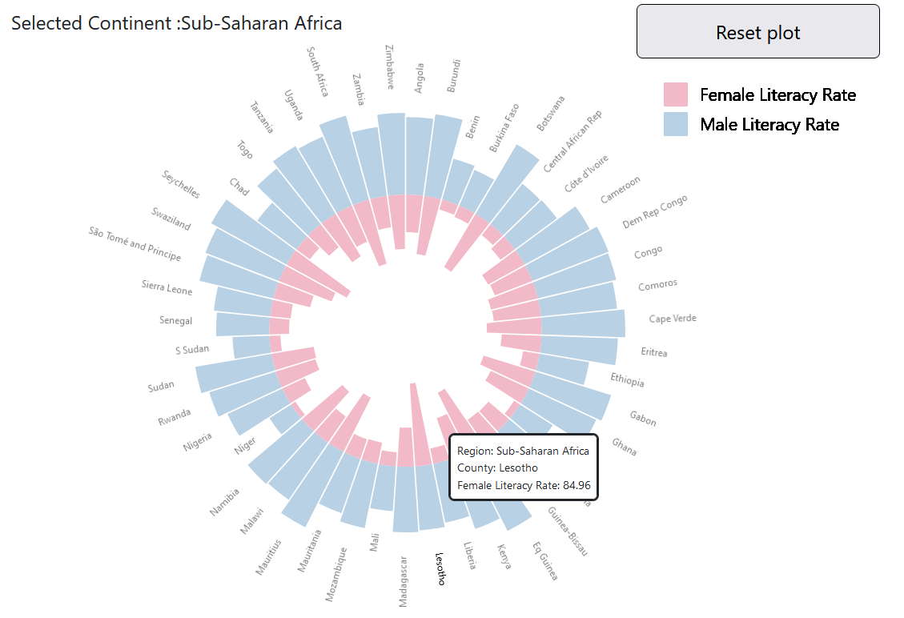
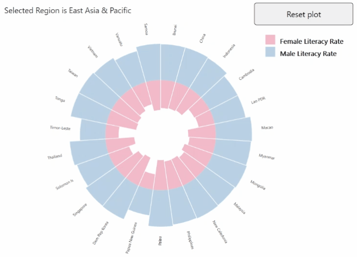

# Extra credit assignment

## Homework: Combining Charts and D3 Linkage

### Purpose

The purpose of this assignment is to practice combining two different types of bar charts for detailed comparison. This assignment also focuses on linking  two different bar charts to add interactivity to the solution. By the end of this assignment, you should be able to,

    1. Group and filter the datasets using D3 clauses
    2. Visualize data in combined bar chart
    3. Visualize content in a doubled circular barplot 
    4. Update charts based on user interaction either by using different charts or using HTML elements
    5. Highlight selected blocks
    6. Add interactive tooltip

### Overview
In this assignment, you have to analyze the literacy rate in different regions as well as countries using two different types of bar plots.

The starter code for this assignment has three sections in `index.html`.
- The first section has a button to reset the plot and paragraph tag to display the selected region's name. 
    - By clicking on the `Reset Plot` button, the initial plot will be shown (i.e. plot which has data of all countries).
- The second section has a bar plot(graph on left), which shows the average literacy rate of females and males in each region. They are separated by different color coding. 
- Whereas the third section shows a doubled circular barplot which will display data of countries either from selected region or if any region is not selected then it visualizes data for all countries. 
    - The doubled circular chart on the right displays the female literacy rate on the inner boundary and the male literacy rate on the outer boundary for each country. 
    - Initially, data for all countries will be shown in a doubled circular bar plot. By clicking on any bar from the left linear bar plot section, corresponding data of countries from the selected region will be shown on a doubled circular plot in the right section. 

### Dataset description
In this assignment, you should use the dataset based on the literacy rate of various countries in the world. The file `Adult_Literacy_Rate.csv` is located in the `data/` folder. This dataset contains details of various countries, the region they belong to, and literacy rates. The dataset has two different types of literacy rates: the literacy rate of females(`LITERACY_RT_FEMALE` attribute) and the literacy rate of males(`LITERACY_RT_MALE` attribute).

The visualization you will create(refer to image below) will be based on the literacy rate of females and males, based on various regions (`region_wb` attribute) and countries(`name` attribute) in those regions. 

The chart on the left will show the average literacy rate of males (blue bar) and average literacy rate of females (pink bar) in a particular region. You might have to compute this individual literacy using basic mathematical operations. 

### To Start the Assignment

- Clone the starter code template.
- Start the local server and load the index page.
- Update your source code as per instructions to complete the following tasks.
- Verify your changes. 
- Commit and push them to this repository to submit your assignment. The result should look like this: 

### Assignment Steps

####  Step 0: Starting Code
Firstly run the index.html page, you can see an empty interface with a button and two sections for 2 different charts. As these sections doesn't have borders it will not be visible on screen but you can directly refer the code. It is entirely up to you whether you want to write your JavaScript code in the main index.html file or a separate JS file.

####  Step 1: Plot a Linear Bar Chart
In this section, you have to plot the literacy rate for each 6 regions. Each region has two bars, the blue bar indicates the average literacy rate of males in all countries in this region. Similarly, the pink bar is for the average female literacy rate.

- To display the average literacy rate for each gender, you need to perform data wrangling operations. The given dataset has two literacy rates: the literacy rate of females(`LITERACY_RT_FEMALE` attribute) and the literacy rate of males(`LITERACY_RT_MALE` attribute). 
**For eg.** In the South Asia region to find the average literacy rate in males, you have to find the summation of the literacy rate of males in all countries in this region and divide it by the total number of countries in this region. 
- Use svg with an id of `#bar_plot` for visualizing this linear bar plot.
- Now, create the x and y axis for the bar plot. You can use a linear scale for the y-axis with a range from 30 to 100. For the x-axis, you can use a categorical scale (i.e. `d3.scaleBand()` ) for all regions.
- The bar shown in the figure has two bars for a single region which are placed closely. To make sure these bars don't overlap give a small amount of offset.
- Now plot the derived data for the average literacy rate for each gender in each region. You can use any color scheme you like, just that the color scheme should be consistent in both of these graphs.
- Plot the x and y-axis.  

> 🔍 **Hint:**  Reference for plotting basic barplot: https://d3-graph-gallery.com/graph/barplot_basic.html

####  Step 2: Plot a Doubled Circular Bar Chart 
In the right section, you have to plot the literacy rate for each country by gender. You have to plot given countries' data in a circular fashion.
> 🔍 **Hint:**  References for plotting doubled-circular barplot: https://d3-graph-gallery.com/graph/circular_barplot_double.html

- Use svg with an id of `#circular_bar_plot` for visualizing this doubled circular bar plot.
- In this plot, you might need 3 scales: an x-scale representing countries(use `d3.scaleBand()`), a y-scale for outer bars which represents male literacy rate, and another y-scale for inner bars which represents female literacy rate. The y-scale for outer bars will be used to plot the literacy rate of males and similarly inner y-scale will be used to plot the female literacy rate.
    > 🔍 **Hint:**  For better readability, the range of both y-scale should not have a max value of 100%, you can add some buffer which will create proper spacing. The attached solution is using range from 0-125. You can use any other range more than 0-100.
   
- Plot the male literacy rate male on the outer border on the first y-axis and the female literacy rate on the inner border with another y-axis.
- To plot the bar radially, you need to draw a rectangle for a given country. Use `d3.attr( "d" , d3.arc() )` for this.
- Add padding of 1 pixel between each bar on the circle.
- The angle used by each country on the x-axis will be equal to the bandwidth of the x-scale.
- After plotting bars on the inner and outer sections, you have to add a text label for each bar on top of it. This label is a country name for the bar(`name` attribute from the dataset). 
> 🔍 **Hint:** For readability, add some buffer so that bar and text don't overlap.You can use any value of buffer here.

The resulting output should look like this:

####  Step 3: Interlink both bar charts with D3

When the user clicks on any bar for a region from the graph on the left side, the doubled circular barplot on the right will only show countries from that selected region.
- Use the `mouseclick` event handler to plot the chart on the left. 
- The width of each bar should be adjusted according to the number of countries in the region to make a full circle of 360 degrees.
- If the user clicks on the bar from a different region, re-load the doubled circular plot accordingly.

####  Step 4: Add a tooltip on both charts 
Now, for interactivity, you have to add tooltips to both of these charts. When the user hovers over any bar a tooltip should be shown.

- In the linear bar plot(left chart), on hovering over a bar a tooltip will show "Region" and "Average Male Literacy Rate" or  "Average Female Literacy Rate" respectively (refer to image in the step 3).
-  In doubled circular bar plot, on hovering over the bar show a tooltip with "Country", "Region" and "Female Literacy Rate" or "Male Literacy Rate" respectively.

- The tooltip should be on white background, with a black rounded border. The tooltip should disappear when the mouse pointer leaves the bar. You can use various mouse events like mouseover, mouseover, and mouseout.
> 🔍 **Hint:** There are multiple ways to implement tooltips. Some reference : https://d3-graph-gallery.com/graph/interactivity_tooltip.html

####  Step 5: Resetting Circular Bar Chart
Now, that both of the graphs are plotted. In this step, you need to add functionality to a reset button which is located on top right corner near doubled circular bar plot. 
If the user clicks on the `Reset Plot` button, then clear the previous plot and display data of all countries.
 
####  Step 6: Add Common Legend and Labels
 To allow users to identify what is going on in the graph, you need to add a common legend for both of these graphs.
- To do this, place a legend in the top right corner below the `Reset Plot` button.  The legend should include a square with colored labels. The legend should be of format "Female Literacy Rate" and "Male Literacy Rate".
- Add titles to the x and y axis on the linear bar plot. The title for the x-axis should be "Region" and for the y-axis, it should be "Average Literacy Rate". 
> 🔍 **Hint:** For the labels on the x-axis, make sure to rotate the text label on the x-axis so that they don't overlap. 

####  Step 7: Hovering over circular bars(extra credit)
For better understanding, you need to increase the size of the selected bar on doubled circular barplot by hovering over it. And returned the bar to its actual size after moving the mouse pointer out of it.
- When the user hovers over the bars for male literacy rate, which are plotted in step 2, the length of the bar would increase and the hovered bar would appear bigger. The height of the bar will increase in the outwards direction (away from the center). 
-   When the user hovers over the bars for female literacy rate, which are plotted in step 2, the length of the bar would increase in the direction the inward. The height of the will increase towards the center of the circle.
> 🔍 **Hint:** In this step, you can add constant buffer with value from y-scale on hovering over a bar. After moving the mouse pointer out of the bar, remove the added buffer, this will bring the bar back to its normal size.

Bring back the bars to their original size after the mouse pointer moves out of the region.

####  Step 8 : Populate Selected Region(extra credit)
In the index.html file, you can see a paragraph tag. Initially, there is no content added to this tag. For allowing users to know which region was selected earlier, you need to populate the name of the selected region as text in this paragraph. You can add text with any content just the region name should be specified. The given solution uses the "Selected Region is region_name" format.

- When none of the regions is selected then this text block should be empty. Also, when the `Reset Plot` button is clicked then the content in the paragraph should be empty.

The final results should look like:

https://user-images.githubusercontent.com/31732637/235585441-cef20962-4a97-47a0-a3e2-83e37ecdc3a2.mp4

